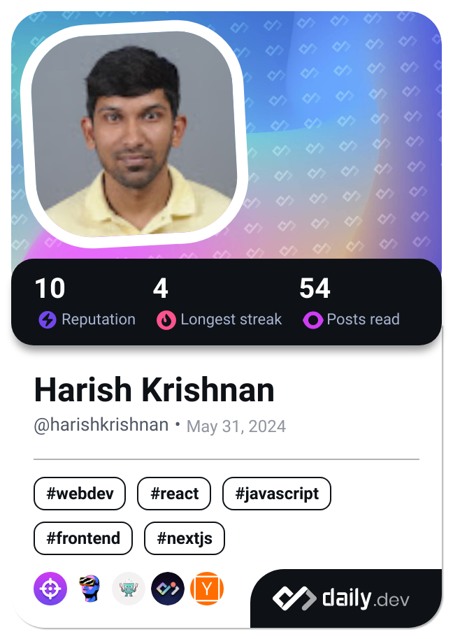

# Hi, I'm Harish Krishnan 👋

 

---

## 👨‍💻 About Me

I'm a **Full-Stack Software Engineer** with over **7 years** of professional experience in building scalable, high-performance applications. My passion lies in crafting elegant solutions to complex problems and contributing to the open source community.

### What I Do

- 🚀 Design and develop full-stack applications with modern frameworks
- 🤖 Explore AI/ML integration and distributed systems architecture
- 🌐 Build scalable cloud-native solutions
- 📝 Share knowledge through technical writing
- 💡 Contribute to open source projects

### Core Expertise

**Languages & Frameworks**
- Frontend: React.js, Angular, Vue.js, Svelte, Next.js, React Native
- Backend: Node.js, Nest.js, Go, Rust, Python
- Data: GraphQL, MongoDB, PostgreSQL

**Technologies**
- Cloud Platforms: AWS
- Web Technologies: JavaScript, TypeScript, HTML5, CSS3

### Current Focus

🎯 Deepening expertise in **Artificial Intelligence** and **Distributed Systems**  
📚 Always learning, always growing  
🔨 Improving software craftsmanship

---

## 📊 GitHub Statistics

---

## 🎓 Certifications

View my professional certifications and badges on [Credly](https://www.credly.com/users/harish-krishnan.623b2d03)

---

## ✍️ Latest Blog Posts

<!-- BLOG-POST-LIST:START -->
<!-- BLOG-POST-LIST:END -->

---

## 🌟 Open Source Contributions

<picture>
  <source media="(prefers-color-scheme: dark)" srcset="https://raw.githubusercontent.com/harishkrishnan24/harishkrishnan24/main/github-snake-dark.svg">
  <source media="(prefers-color-scheme: light)" srcset="https://raw.githubusercontent.com/harishkrishnan24/harishkrishnan24/main/github-snake.svg">
  
</picture>

  

### Check out my pinned repositories below! 👇

---

## 🤝 Connect With Me

---

💙 Open to interesting opportunities and collaborations
 
⚡ This profile auto-updates daily with latest contributions and blog posts

