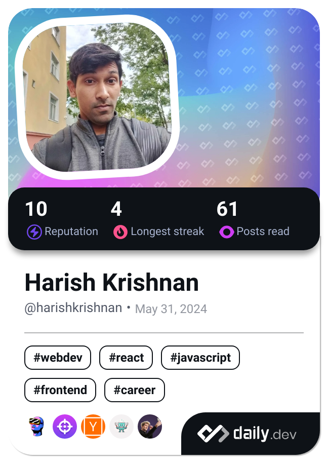

<div align="center">

```
██╗  ██╗ █████╗ ██████╗ ██╗███████╗██╗  ██╗    ██╗  ██╗██████╗ ██╗███████╗██╗  ██╗███╗   ██╗ █████╗ ███╗   ██╗
██║  ██║██╔══██╗██╔══██╗██║██╔════╝██║  ██║    ██║ ██╔╝██╔══██╗██║██╔════╝██║  ██║████╗  ██║██╔══██╗████╗  ██║
███████║███████║██████╔╝██║███████╗███████║    █████╔╝ ██████╔╝██║███████╗███████║██╔██╗ ██║███████║██╔██╗ ██║
██╔══██║██╔══██║██╔══██╗██║╚════██║██╔══██║    ██╔═██╗ ██╔══██╗██║╚════██║██╔══██║██║╚██╗██║██╔══██║██║╚██╗██║
██║  ██║██║  ██║██║  ██║██║███████║██║  ██║    ██║  ██╗██║  ██║██║███████║██║  ██║██║ ╚████║██║  ██║██║ ╚████║
╚═╝  ╚═╝╚═╝  ╚═╝╚═╝  ╚═╝╚═╝╚══════╝╚═╝  ╚═╝    ╚═╝  ╚═╝╚═╝  ╚═╝╚═╝╚══════╝╚═╝  ╚═╝╚═╝  ╚═══╝╚═╝  ╚═╝╚═╝  ╚═══╝
```


</div>

---

## 🖥️ &nbsp;`$ cat about.txt`

<table>
<tr>
<td width="40%" align="center">

```
┌─────────────────────┐
│                     │
│   [AUTHENTICATED]   │
│                     │
```


```
│                     │
│   harish@github     │
│                     │
└─────────────────────┘
```

</td>
<td width="60%">

<pre>
<span style="color:#00FF00">harish@github</span>:<span style="color:#00BFFF">~</span>$ ls -la profile/
drwxr-xr-x  identity/
    ├── Full-Stack Software Engineer
    ├── 7+ years of industry experience
    ├── Open Source Contributor
    └── Lifelong Learner

drwxr-xr-x  languages/
    ├── JavaScript / TypeScript
    ├── Go
    ├── Rust
    ├── Python
    └── HTML / CSS

drwxr-xr-x  frontend/
    ├── React.js
    ├── Angular
    ├── Vue.js
    ├── Svelte
    ├── Next.js
    └── React Native

drwxr-xr-x  backend/
    ├── Node.js
    ├── Nest.js
    └── GraphQL

drwxr-xr-x  databases/
    ├── MongoDB
    └── PostgreSQL

drwxr-xr-x  cloud/
    └── AWS

drwxr-xr-x  interests/
    ├── AI / Machine Learning
    ├── Distributed Systems
    └── Software Craftsmanship

<span style="color:#00FF00">harish@github</span>:<span style="color:#00BFFF">~</span>$ █
</pre>

</td>
</tr>
</table>

---

## 📊 &nbsp;`$ ./github-stats.sh`

<div align="center">


</div>

<div align="center">


</div>

<div align="center">


</div>

---

## 🎓 &nbsp;`$ cat certifications.json`

<div align="center">

```
[═══════════════ CERTIFICATIONS ═══════════════]
```

Visit my [Credly profile](https://www.credly.com/users/harish-krishnan.623b2d03) to view all certifications and badges.

[](https://www.credly.com/users/harish-krishnan.623b2d03)

</div>

---

## 📝 &nbsp;`$ tail -f blog/latest.log`

<div align="center">

```
[═══════════════ LATEST BLOG POSTS ═══════════════]
```

</div>

<!-- BLOG-POST-LIST:START -->
<!-- BLOG-POST-LIST:END -->

<div align="center">

[](https://harishkrishnan1993.medium.com/)

</div>

---

## 🌟 &nbsp;`$ git log --graph --all --author="harishkrishnan24"`

<div align="center">

```
[═══════════════ OPEN SOURCE CONTRIBUTIONS ═══════════════]
```

<picture>
  <source media="(prefers-color-scheme: dark)" srcset="https://raw.githubusercontent.com/harishkrishnan24/harishkrishnan24/main/github-snake-dark.svg">
  <source media="(prefers-color-scheme: light)" srcset="https://raw.githubusercontent.com/harishkrishnan24/harishkrishnan24/main/github-snake.svg">
  
</picture>

<table>
<tr>
<td width="50%" align="center">

<a href="https://app.daily.dev/harishkrishnan24">

</a>

</td>
<td width="50%">

<pre>
<span style="color:#00FF00">$</span> git status

On branch main
Active contributor to:
  ├── Open Source Projects
  ├── Community Discussions
  └── Code Reviews

<span style="color:#00FF00">$</span> git log --oneline
Check out my pinned 
repositories below! 📌

<span style="color:#00FF00">$</span> █
</pre>

</td>
</tr>
</table>

</div>

---

## 🔗 &nbsp;`$ curl -X GET connect.sh`

<div align="center">

```bash
# Execute connection protocols
```

[](https://www.linkedin.com/in/harishkrishnan1993/)
[](https://harishkrishnan1993.medium.com/)
[](https://stackoverflow.com/users/7962294/k-harish)
[](https://www.credly.com/users/harish-krishnan.623b2d03)
[](https://app.daily.dev/harishkrishnan24)
[](https://harishkrishnan24.github.io/me/)

```bash
# Connection established successfully ✓
```

</div>

---

<div align="center">

```
╔══════════════════════════════════════════════════════════════════╗
║  "Never stop learning. Stay curious. Build amazing things."     ║
╚══════════════════════════════════════════════════════════════════╝
```

<sub>⚡ This profile auto-updates daily with latest stats and blog posts</sub>

</div>
